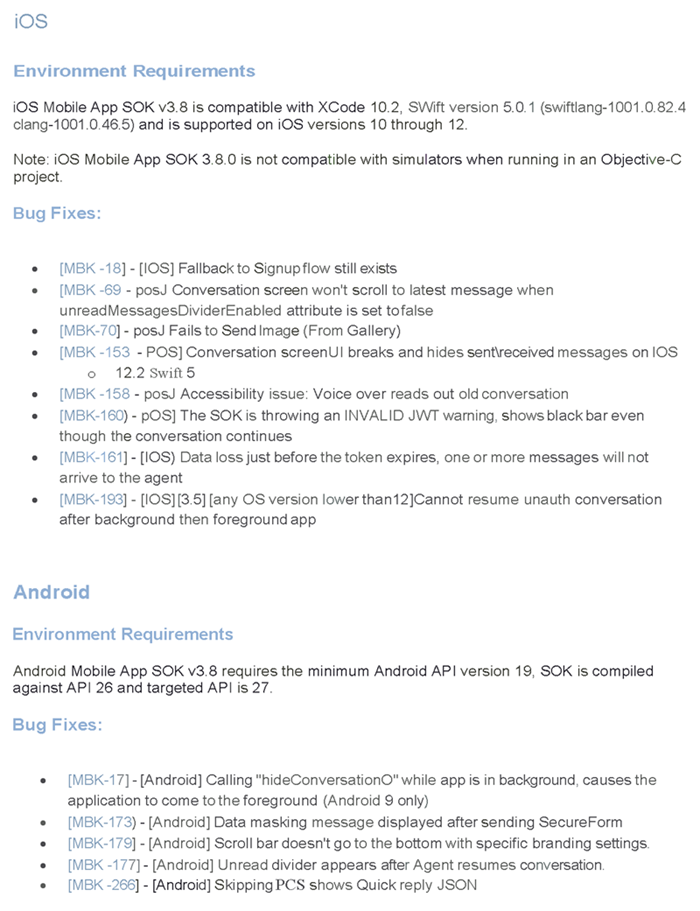
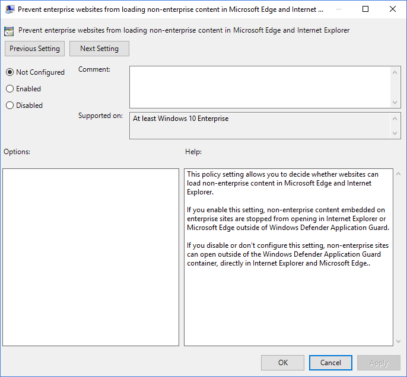
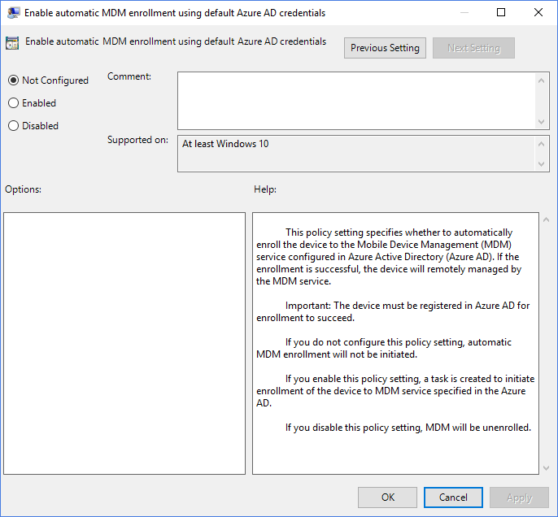
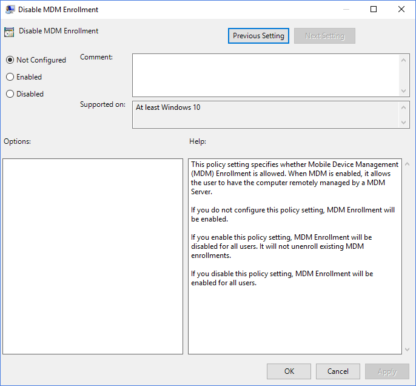

# UX Writing Samples
Take a look at the UX writing sample before and after versions.

## Mobile SDK Release Notes

>**Project:**  Work-related  
>**Description:** Write simple release notes for the customer by giving them either the scenario in which the problem occurred and, most importantly, what the bug is preventing or both.   
>**Date of the rewrite:** May 21, 2019   

#### Original




#### Rewrite 

The iOS Mobile SDK version 3.8 is compatible with Xcode 10.2, Swift version 5.0.1 (swiftlang-1001.0.82.4 clang-1001.0.46.5), and supported on iOS versions 10 through 12.

**Important:** The iOS Mobile SDK version 3.8 is not compatible with simulators when running in an Objective-C project.

##### Bug Fixes

- When the `unreadMessagesDividerEnabled` attribute equaled **false**, the conversation window did not jump/scroll to the latest messages received by the agent as expected.

   By default, the Unread Message Divider separator appears in the message view.   When enabled, this feature does not prevent the badge or message text from displaying on the **Scroll to Bottom** button. Instead, the Unread Message Divider system message shows above the unread messages within the view of the user when returning to the conversation view. When disabled, the separator does not appear, and the unread message badge count displays on the **Scroll to Bottom** button. 

- Fallback to Signup Flow still existed. The bug prevented users from starting an authenticated conversation, and instead, the conversation started an unauthenticated visitor mode chat.

- Send Image (From Gallery) failed. The bug prevented users from uploading images larger than 3MB, resulting in a ‘file too large’ message. Version 3.8 of the Mobile SDK increased the image size limit to 5MB. 

- **On iOS 12.2 Swift 5**, the conversation screen did not show the sent or received messages, and the margins appeared between messages. 

- Accessibility: voice over read old conversations.  The bug prevented the voice over feature, when enabled, to read the current conversation, and instead, skipping back to past conversations. 

- When trying to reconnect with a JWT after the initial token expired, an INVALID JWT warning appeared and showed a black bar even though the conversation continued without error.  

- Before the token expired, the agent did not receive one or more messages resulting in data loss. The bug prevented messages from being sent regardless of the token expiration.

- **For iOS versions lower than 12.** When starting an unauthenticated conversation, then backgrounding the app and then foregrounding it again, the loading screen remained displayed. The bug prevented users from going in and out of the conversation without issue.

## How-To's

#### Mobile SDK - Photo and file sharing

Mobile SDK v3.9 introduces a feature for agents within the app to share photos or files with the consumers.  Agents can share a reference photo or photos of any product to visually guide consumers with product awareness, steps on how to use the product, or review comments of a product.  Agents can also share files to provide consumers with information such as mortgage documents, product catalog, or transaction details as requested by consumers. Agents can even share photos or files in a resolved conversation to resume the conversation with the consumer.

When the agent shares any supported file type, if the consumer isn't within the conversation view, they get a notification from the customer app only if the push notification is enabled. Otherwise, when the consumer returns, a thumbnail for the photo or file appears in the conversation window.

- **Files:** the consumer can tap on it to view it full screen, share it through the default app on the device, or save it to a location on the device.

   The Android SDK supports opening any file types other than images through the picker application. The consumer can either long click on the thumbnail or open the file through the picker application to share and save the file.

   The iOS SDK supports the opening of all the supported file types on the device as per the iOS operating system.

- **Photos:** the consumer can tap on the photo to view it full screen or share it through the default app on their device.  Consumers cannot download images; they can only preview or share images.

##### Supported formats

- PNG
- JPG/JPEG
- GIF (non-animated) - previewed as a static image only
- PDF
- DOCX
- PPTX
- XLSX

##### Photo and file sizes

- Thumbnail - 30 KB (base64-encoded)
- Max upload size allowed - 5 MB uncompressed

**For SDKs previous to 3.8.** The max upload size allowed is 3 MB.

##### Notes and limitations

- Photo sharing is two way (agent-to-consumer and consumer-to-agent). Still, file sharing is one way only (agent to consumer).

  **For SDKs previous to 3.8:** Photo-sharing is one-way only (from consumer-to-agent, but not vice versa) and available for the Mobile Message SDK only.

- If an attempt to view a photo is unsuccessful, an error icon covers the thumbnail.

- If an attempt to download a file is unsuccessful, an error icon covers the thumbnail.  Upon retry, the file attempts to download again. Retry can be attempted as many times as possible (in case of a poor network) till the file download successfully.

- The consumer can return to a resolved conversation to view the photos, as long as the photos are part of the conversation history.

- If an agent sends an unsupported file, a message shows indicating the file type is not supported, and the agent should retry sending a supported file format. On the consumer side, they see an empty message with no content.

- For authenticated users, backgrounding the app while loading the photo does not get interrupted.

- For unauthenticated sessions, consumers must tap the photo again with each visit because the history gets cleared when a session expires or logs the consumer out.

##### How photo sharing works - Android

**For Android SDK 3.0 on an Oreo Device (8.0 &amp; 8.1).** Add support for Notification Channel.

###### Step 1. Enable or disable

1. Change the boolean value:

   `<bool name="enable_photo_sharing">`

   By default, this value is **false**.

2. Contact your Account Team to have the feature enabled on your account.

###### Step 2. Change settings

1. Set the max number of photos or files to save on disk:

   `<integer name="max_number_stored_images">`

   `<integer name="max_number_stored_documents">`

   The default is 20. If exceeding the max value of photos or files, the SDK deletes the oldest file.

2. Set the max image size:

   `<integer name="max_image_size_kb">`

   The default max image is 3000kb.

3. Change the color of the attachment menu:

   `<color name="attachment_menu_item_background_color">`

   `<color name="lp_attachment_menu_background_color">`

   `<color name="lp_attachment_menu_item_text_color">`

   `<color name="lp_attachment_menu_item_icon_color">`

4. Change the text of buttons:

   `<string name="lp_accessibility_gallery">`

  `<string name="lp_accessibility_camera">`

5. Define the max number of stored images allowed locally.

   `<integer name="max_number_stored_images">`

   The default max number is 20.

6. Define the resize dimensions:

   `<integer name="thumbnail_longer_dimension_resize">`

   The default thumbnail dimension is 100.

   `<integer name="full_image_longer_dimension_resize">`

   The default full image dimension is 800.

7. Set the compression rate (percentage) for full images:

   `<integer name="full_image_compression_rate">`

   The default compression rate is 50.

   More advanced configurations (image size, compression rate, etc..) can be found under Photo Sharing in the Configuring the SDK section.

##### How photo sharing works - iOS

###### Step 1. Set the requirements for Custom View Controller Mode

When using Custom View Controller Mode, you must remove the Conversation view when leaving the App. To avoid dismissing the View when presenting CSAT/SecureForms/PhotoSharing View, you should only dismiss the Conversation view if Moving From ParentView:

```swift

if (self.conversationQuery != nil && self.isMovingToParentViewController){

  LPMessagingSDK.instance.removeConversation(self.conversationQuery!)

}
```

When using ViewController Mode, on the Navigation Bar Back Button, you can simply call **LPMessagingSDK.instance.removeConversation(self.conversationQuery!)**.

###### Step 2. Add app privacy settings

1. Set the photo library privacy settings:
  
  - **Key:** NSPhotoLibraryUsageDescription
  - **Value:**"Photo Library Privacy Setting for Mobile App Messaging SDK for iOS"

2. Set the camera privacy settings:

  - **Key:** NSCameraUsageDescription
  - **Value:**"Camera Privacy Setting for Mobile App Messaging SDK for iOS"

    Values for these descriptions are up to the brand to define; these are only examples.

3. Set the file-sharing privacy settings:

  - UIFileSharingEnabled: Application supports iTunes file sharing
  - Privacy - Photo Library Usage Description
  - Privacy - Photo Library Additions Usage Description

    iOS supports the preview of file types per iOS operating system and requires some configurations to be enabled ("YES") within the Host App's plist file. Enabling supports file sharing and the export and saving of photos.

4. Save documents or photos to a directory belonging to the host app, enable the following flag with **caution**.  
  
   >**Note:** A current limitation within the SDK causes the SQL files to be public if enabling this setting. Therefore, we suggest you do not enable this setting until a fix is available in a future release.  If this functionality is essential to your user flow, enable at the user's risk.

   LSSupportsOpeningDocumentsInPlace: Supports opening documents in place

###### Step 3. Enable or disable photo and file sharing

1. Change the boolean value:

   `LPConfig.defaultConfiguration.enablePhotoSharing`

   By default, the value is set to **false**.

   `LPConfig.defaultConfiguration.enableFileSharing`

   By default, the value is **true**.

2. Contact your Account Team to have the feature enabled on your account.

###### Step 4. Change the settings

1. Set the max number of photos or files to save on disk:

   `LPConfig.defaultConfiguration.maxNumberOfSavedFilesOnDisk`

   The default is 20. If exceeding the max value of photos or files, the SDK deletes the oldest file.

2. Change the background color of attachment menu:

   `LPConfig.defaultConfiguration.photosharingMenuBackgroundColor`

3. Change the text of buttons:

   `LPConfig.defaultConfiguration.photosharingMenuButtonsTextColor`

4. Change the menu button&#39;s background color:

   `LPConfig.defaultConfiguration.photosharingMenuButtonsBackgroundColor`

5. Change the menu button&#39;s tint color:

   `LPConfig.defaultConfiguration.photosharingMenuButtonsTintColor`

7. Customize the navigation bar on UIDocumentationInteractionController:

   **Window Mode:**

   The UIDocumentationInteractionController adopts applicable branding customizations that have been set, for example:

   - `conversationNavigationBackgroundColor` sets the NavController tint color with translucence set to false.
   - `conversationNavigationTintColor` colors the L & R bar buttons as well as the title color.

   **View Controller Mode:**

      Your custom applicable navigation bar traits apply to the UIDocumentationInteractionController.

      You can find all the related configurations in the [resources ID table](), under Photo Sharing.

## Group Policies
>**Project:**  UX writing challenge
>**Description:** Simplify, simplify, simplify.
>**Date of the rewrite:** January 8, 2019 

#### Do not sync browser setting 

##### Original
Prevent the "browser" group from syncing to and from this PC. This turns off and disables the "browser" group on the "sync your settings" page in PC settings. The "browser" group contains settings and info like history and favorites.

If you enable this policy setting, the "browser" group, including info like history and favorites, will not be synced.

Use the option "Allow users to turn browser syncing on" so that syncing is turned off by default but not disabled.

If you do not set or disable this setting, syncing of the "browser" group is on by default and configuration by the user.

##### Rewrite 

By default, the “browser” group syncs automatically between user’s devices allowing users to make changes. The “browser” group uses the Sync your Settings option in Settings to sync information such as history and favorites.

| Setting | Description |
| ------- | ----------- |
| Disabled or not configured **(default)** | Allowed/turned on |
| Enabled | Prevent/turned off |

>> **Related policies:** Prevent users from turning on browser syncing.

<hr />

#### Prevent enterprise websites from loading non-enterprise content

##### Original



##### Rewrite 

By default, non-enterprise sites open in Internet Explorer and Microsoft Edge outside of the Windows Defender Application Guard container.

| Setting | Description |
| ------- | ----------- |
| Disabled or not configured **(default)** | Allowed |
| Enabled | Prevent |


#### Enable automatic MDM enrollment using default Azure AD credentials

##### Original 



##### Rewrite

With this policy, you can automatically enroll a device to the Mobile Device Management (MDM) service configured in Azure Active Directory (AAD).  The device must be registered in AAD for enrollment to succeed. Once enrolled successfully, the device gets managed remotely by the MDM service.  

| Setting | Description |
| ------- | ----------- |
| Not configured **(default)** | Automatic MDM enrollment does not initiate.  |
| Disabled | Unenroll from MDM. |
| Enabled | A task gets created to initiate MDM enrollment. |


#### Disable MDM Enrollment

##### Original 



##### Rewrite

With this policy, you can prevent Mobile Device Management (MDM) enrollment for all users.   

| Setting | Description |
| ------- | ----------- |
| Disabled or not configured **(default)** | Automatic MDM enrollment initiates. Enable MDM enrollment for all users. |
| Enabled | Disable MDM enrollment for all users. It does not unenroll existing MDM enrollments. |
